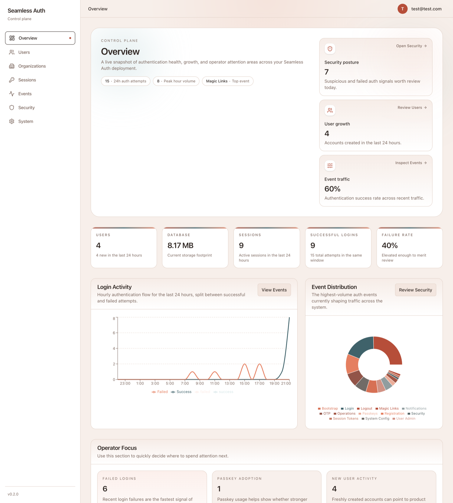
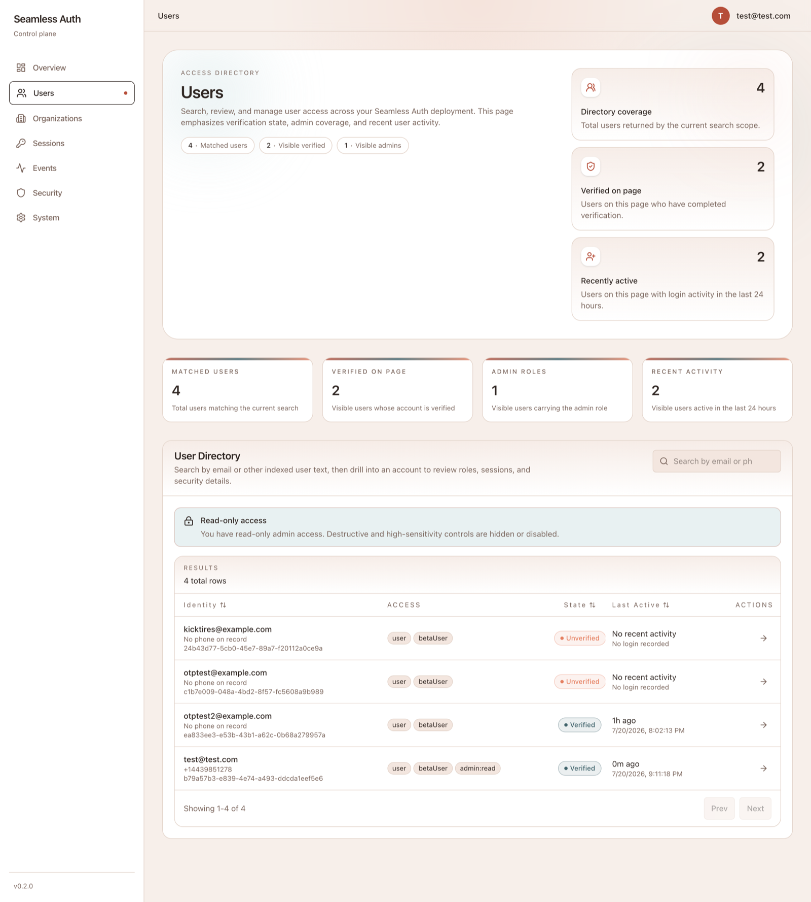
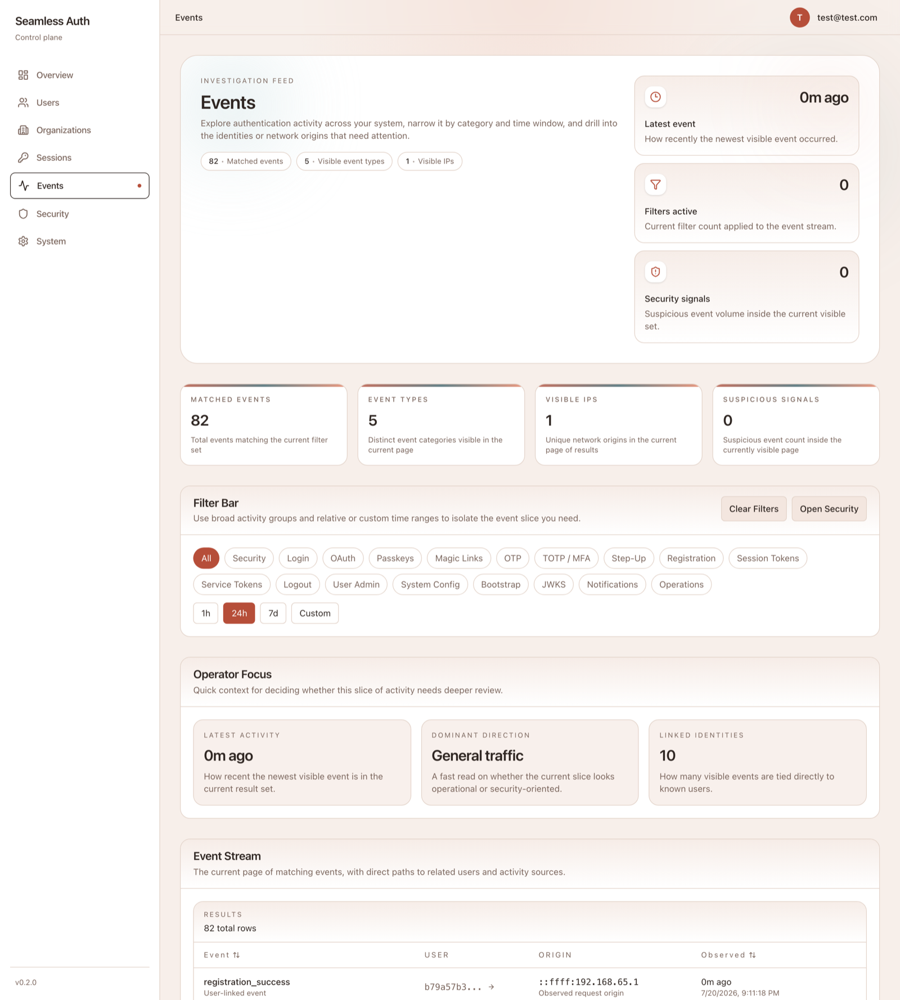
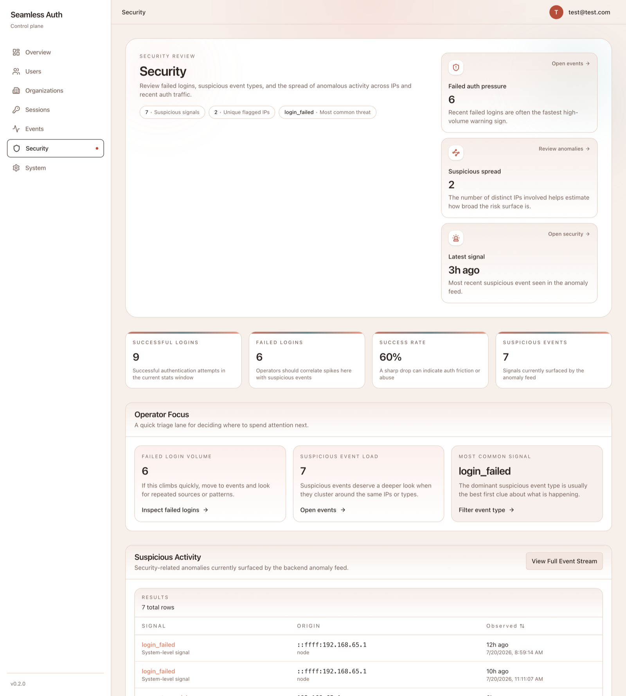
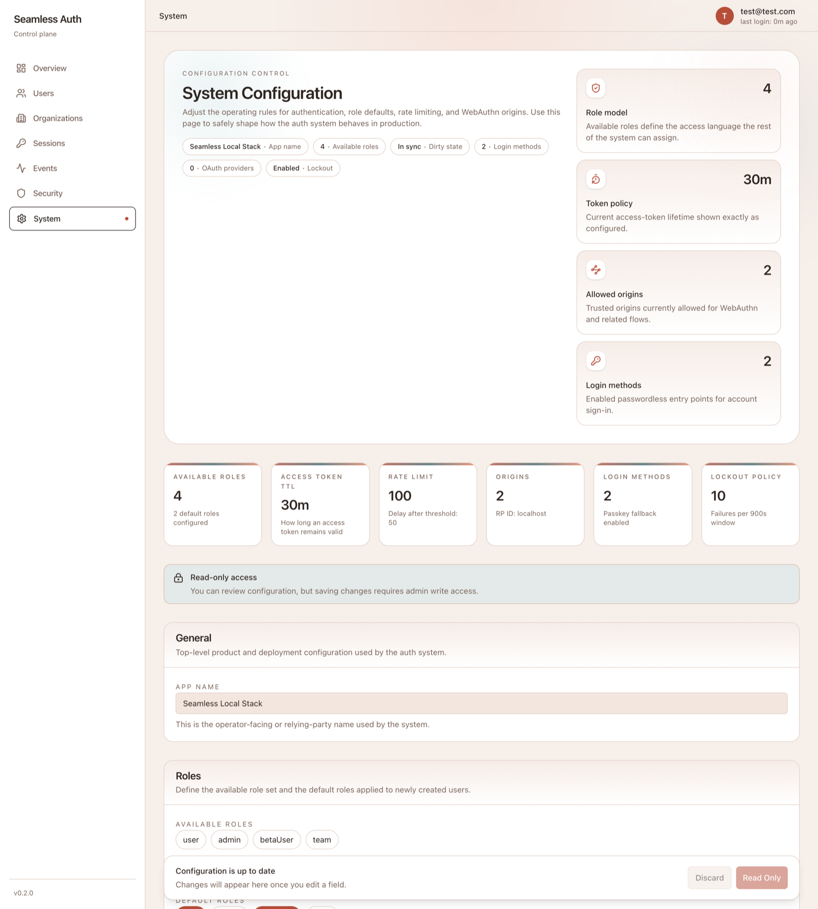

[](https://github.com/fells-code/seamless-auth-admin-dashboard/actions/workflows/docker-publish.yml)
[](#testing)

# Seamless Auth Dashboard

The Seamless Auth Dashboard is a React/Vite admin portal for operating a Seamless Auth deployment. It gives operators direct visibility into authentication activity and lets admins manage users, sessions, security signals, and system configuration from one place.

This app is intended to run alongside the Seamless Auth API as part of a self-hosted auth stack.



## Quick Start

The dashboard is published as a public container image. Point `API_URL` at the
origin serving your Seamless Auth server adapter and it is ready to use:

```bash
docker run -p 8080:8080 \
  -e API_URL=https://app.example.com \
  ghcr.io/fells-code/seamless-auth-admin-dashboard:v0.2.0
```

Then open [http://localhost:8080](http://localhost:8080) and sign in with an
account that has the `admin:read` role.

`API_URL` is read at container start, not baked into the build, so the same
image can be pointed at any environment.

**Point it at your application, not at the Seamless Auth API.** The dashboard
calls `<API_URL>/auth/...`, and those routes belong to the Seamless Auth server
adapter that you mount in your own backend. The adapter reads the dashboard's
session cookie and forwards a bearer token upstream to the Seamless Auth API:

```text
dashboard  ->  <API_URL>/auth/*  ->  server adapter  ->  Seamless Auth API
```

Setting `API_URL` to the Seamless Auth API directly will not work, because the
API does not serve the `/auth` routes the dashboard calls.

**Image tags**: `latest` tracks the newest released version. Pin an explicit
`vX.Y.Z` tag in production so a redeploy cannot move you to a new major.

## Prerequisites

You need two things running before this dashboard is useful: a Seamless Auth
API, and an application backend that mounts the server adapter. The dashboard
talks to the adapter, and the adapter talks to the API.

| Project                                                                    | Purpose                                                                                                                      |
| -------------------------------------------------------------------------- | ---------------------------------------------------------------------------------------------------------------------------- |
| [seamless-auth-api](https://github.com/fells-code/seamless-auth-api)       | The authentication API this dashboard administers. Listens on port 5312 by default. The dashboard does not call it directly. |
| [seamless-auth-server](https://github.com/fells-code/seamless-auth-server) | Server-side SDKs. Mount the adapter at `/auth` in your backend; this is the origin `API_URL` points at.                      |
| [seamless-auth-react](https://github.com/fells-code/seamless-auth-react)   | The React SDK this dashboard is built on.                                                                                    |
| [seamless-templates](https://github.com/fells-code/seamless-templates)     | Example projects showing the adapter wired into an application.                                                              |

A Seamless Auth instance can also serve this dashboard itself at `/console` on
its own origin. See
[Same-origin `/console` build](#same-origin-console-build-auth-instance) if you
want that instead of running a separate container.

## What It Does

- browse and manage users
- inspect sessions and revoke them
- filter and investigate authentication events
- review suspicious activity and anomaly signals
- edit system configuration
- sign in with Seamless Auth headless-client flows, including passkeys, magic links, and OTP fallbacks
- manage organizations and organization membership
- configure allowed login methods and OAuth providers
- configure account lockout policy
- run admin-assisted device-replacement recovery
- require step-up authentication before destructive or high-sensitivity actions
- hide write controls from read-only admins
- operate with runtime config injection in containerized environments

## Screenshots

**Users** — search the directory, review verification and admin coverage, and drill into an account.



**Events** — filter authentication activity by category and time range and investigate individual events.



**Security** — review suspicious activity and anomaly signals worth operator attention.



**System Configuration** — shape roles, login methods, token lifetimes, lockout policy, and WebAuthn origins.



## Tech Stack

- React 19
- Vite
- TypeScript
- TanStack Query
- Tailwind CSS v4
- Recharts
- Vitest + Testing Library

## Runtime Model

This dashboard is built as static assets. It supports two deployment modes that
share one codebase.

### Root build

The default build serves the dashboard from its own root (`/`) with the API base
resolved from runtime config or a baked `VITE_API_URL`.

Runtime configuration is injected at container startup:

- `index.html` loads `/config.js`
- `entrypoint.sh` writes `window.__SEAMLESS_CONFIG__`
- `src/lib/runtimeConfig.ts` reads runtime config first, then falls back to `import.meta.env`

That runtime-config flow is intentional. The dashboard is designed to be reconfigured per environment without rebuilding the frontend image.

Build it with:

```bash
npm run build
```

### Same-origin `/console` build (auth instance)

Each Seamless Auth instance can serve the dashboard at `/console` on its own
domain, same origin as the auth API. Same origin means passkeys and CORS just
work.

Build it with:

```bash
npm run build:console
```

That script sets two build vars:

- `VITE_BASE_PATH=/console/`: Vite emits assets under `/console/` and the React
  Router basename is set to `/console`, so client-side routes and deep links
  resolve there.
- `VITE_SAME_ORIGIN=true`: `src/lib/runtimeConfig.ts` derives the auth API base from
  `window.location.origin` instead of `VITE_API_URL`, so requests stay same-origin.

Runtime `config.js` injection still takes precedence when present, so a same-origin
build can still be pointed at an explicit API base if needed.

The auth server serves `index.html` for unknown `/console/*` routes (SPA history
fallback), so deep links into the dashboard work on refresh.

## Security Model

Authorization in this dashboard is client-side and exists only for user
experience: hiding controls, redirecting unauthenticated visitors, and avoiding
dead ends. It is not a security boundary.

- `RequireAuth` gates routes on `admin:read` and `useAdminPermissions` toggles
  read and write UI, but both run in the browser and can be bypassed by anyone
  with the bundle.
- `hasScopedRole` (`src/lib/scopedRoles.ts`) mirrors the server's role scoping so
  the UI reflects likely outcomes. It is a convenience, not enforcement.

Every protected action must be authorized by the Seamless Auth API. The API is
the single enforcement point, and the dashboard assumes it rejects any request
the current session is not entitled to make, regardless of what the UI shows.

## Features

### Overview

- operator landing page with metrics, charts, and investigation entry points

### Users

- list, search, create, edit, and delete users
- drill into individual user detail
- require fresh step-up authentication before create, edit, delete, session revoke, and device-recovery actions

Admin user deletion follows the Seamless Auth API contract:

```http
DELETE /admin/users
Content-Type: application/json

{ "userId": "user-id" }
```

When the server adapter is mounted at `/auth`, the dashboard sends this as `DELETE /auth/admin/users`.

### Organizations

- list and inspect organizations
- create and update organizations
- add, update, and remove organization members

### Sessions

- inspect active sessions
- revoke individual sessions

### Events

- browse authentication events
- filter by grouped event type and time range
- deep-link into filtered views

### Security

- review anomaly and suspicious activity signals
- navigate from security context into event investigation

### System Configuration

- manage available roles and auth settings
- enable or disable login methods such as passkeys, magic links, OTP, and OAuth
- configure OAuth providers without entering provider client secrets in the browser
- configure lockout policy for repeated failed login attempts

Role management supports scoped role names such as `admin:read` and `admin:write`. Dashboard access
accepts the legacy `admin` role, `admin:read`, or `admin:write`. Read-only admins can inspect
users, sessions, organizations, events, and config, but destructive controls are hidden or disabled.

#### OAuth Provider Configuration

The dashboard edits the Seamless Auth API `oauth_providers` system config. OAuth is enabled by
turning on the `OAuth` login method and adding one or more provider records.

Each provider record includes:

- provider id, such as `google` or `github`
- display name
- client id
- `clientSecretEnv`, the name of the server environment variable holding the client secret
- authorization URL
- token URL
- userinfo URL
- requested scopes
- exact redirect URI allowlist
- JSON paths used to read provider subject, email, email verification, and name from the userinfo response
- account-linking policy
- email verification policy
- signup policy

The dashboard intentionally does **not** collect provider client-secret values. Store those secrets
on the Seamless Auth API host and reference them by environment variable name, for example
`GOOGLE_CLIENT_SECRET`. Provider cards show only that a secret environment variable is configured;
use the edit form when you need to change the configured environment variable name.

Example provider configuration:

```json
{
  "id": "google",
  "name": "Google",
  "enabled": true,
  "clientId": "google-oauth-client-id",
  "clientSecretEnv": "GOOGLE_CLIENT_SECRET",
  "authorizationUrl": "https://accounts.google.com/o/oauth2/v2/auth",
  "tokenUrl": "https://oauth2.googleapis.com/token",
  "userInfoUrl": "https://openidconnect.googleapis.com/v1/userinfo",
  "scopes": ["openid", "email", "profile"],
  "redirectUri": "https://app.example.com/oauth/callback",
  "redirectUris": ["https://app.example.com/oauth/callback"],
  "subjectJsonPath": "sub",
  "emailJsonPath": "email",
  "emailVerifiedJsonPath": "email_verified",
  "nameJsonPath": "name",
  "allowSignup": true,
  "accountLinking": "email",
  "requireEmailVerified": true
}
```

After saving config, clients can discover enabled providers with `GET /oauth/providers` and start
login with `POST /oauth/:providerId/start`.

#### Lockout Policy

The dashboard edits the API `lockout_policy` system config. Operators can enable or disable
lockout, set the failed-attempt threshold, set the counting window, and choose how long identified
users remain locked. This complements route-level rate limits; it does not replace destination or
IP-based abuse controls.

#### Device Replacement Recovery

The user detail page includes a device-replacement action for write admins. The API requires a
fresh step-up session before it will revoke sessions, remove passkeys, and disable TOTP for the
target user. The dashboard shows only the resulting counts and never displays credential secrets.

### Appearance

- multiple built-in themes
- light and dark modes
- appearance switching from the user menu

## Development

This repository targets Node 24, pinned in `.nvmrc` and enforced through the
`engines` field.

```bash
nvm use
npm install
```

Copy the environment example and point it at your running API. The dashboard
throws on startup if no API URL is configured, so this step is required:

```bash
cp .env.example .env
```

`VITE_API_URL` is the origin that serves the Seamless Auth server adapter, which
is normally your own application's backend rather than the Seamless Auth API. The
example uses `http://localhost:3000`; change it to wherever your adapter runs.

Start the dev server:

```bash
npm run dev
```

The app will be available at [http://localhost:5173](http://localhost:5173).

## Scripts

```bash
npm run dev
npm run lint
npm run format
npm run format:check
npm run typecheck
npm test
npm run coverage
npm run build
npm run build:console
```

## Release Preparation

Commits to `main` run the release-preparation workflow. That workflow validates the dashboard, runs
Changesets versioning, updates `CHANGELOG.md` and `package.json`, and opens or updates a version PR
for review.

The workflow does not publish packages, create GitHub releases, or push release tags. Releases are
generated manually after the version PR has been reviewed and merged.

## Local Configuration

You can provide config through Vite env vars for local development:

```bash
VITE_API_URL=http://localhost:3000
```

In production-like deployments, prefer the runtime `config.js` injection flow instead.

## Testing

The repo includes a frontend test setup using Vitest, Testing Library, and jsdom.

Useful commands:

```bash
npm test
npm run coverage
```

Coverage is currently focused on shared components and `src/lib` helpers.

## Docker

Most deployments should use the published image shown in
[Quick Start](#quick-start). Building locally is for working on the image
itself.

Build the container image locally:

```bash
npm run docker:build
```

Run it locally, overriding the API it points at if needed:

```bash
API_URL=http://host.docker.internal:3000 npm run docker:run
```

The production image serves the built frontend through nginx and includes a container health check.

## Project Structure

```text
src/
  components/
  hooks/
  lib/
  pages/
  types/
```

- `components`: shared UI primitives and app shell
- `hooks`: data fetching and mutations
- `lib`: helpers, config, and domain utilities
- `pages`: top-level route screens
- `types`: shared frontend types

## Design Notes

The dashboard is intentionally lightweight:

- explicit routes instead of heavy meta-framework conventions
- thin pages and focused hooks
- shared UI primitives over a component framework
- theme-aware styling through shared CSS tokens
- URL-driven filter state where it improves operator workflows

## Current State

The app is functional and meant for real use. The current focus is on consistency, operator ergonomics, and tightening the remaining rough edges.

Known areas still worth attention:

- The dashboard assumes the SeamlessAuth server adapter is mounted at `/auth`
- the Seamless Auth server adapter and upstream API docs should stay aligned with dashboard route contracts, especially destructive admin mutations
- a few query invalidation paths remain narrower than ideal
- chart components have lighter test coverage than the shared shell and utility layers
- page-level end-to-end coverage against a real Seamless Auth deployment is still limited

## Contributing

Contributions are welcome. Start with the
[organization contributing guide](https://github.com/fells-code/.github/blob/main/CONTRIBUTING.md),
then read `AGENTS.md` in this repository for the architecture, the conventions
it enforces, and the checks to run before opening a pull request.

If this dashboard is useful to you, consider starring the repository. It helps
other people find the project. A workflow leaves the same reminder on new pull
requests, but it is only a nudge and never blocks a contribution.

## License

AGPL-3.0
